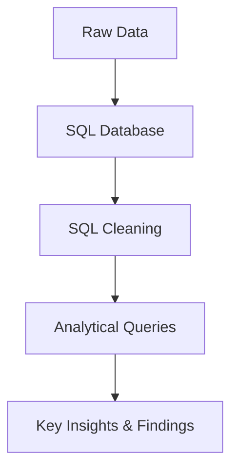

# 📺 Netflix Movies and TV Shows Data Analysis  


## **Project Overview**  
This project explores Netflix’s vast library of movies and TV shows using SQL, aiming to uncover **content trends, distribution patterns, and audience preferences.** By analyzing the dataset, we derive key insights into content types, ratings, release trends, country-wise distribution, and genre classifications.  

### **Key Objectives**  
- Understand the **distribution** of content (Movies vs. TV Shows).  
- Identify the **most common ratings** and their target audiences.  
- Analyze **content trends by release year and country** to uncover regional preferences.  
- Investigate **popular genres and their frequency**.  
- Examine **actors, directors, and movie durations** for deeper content insights.  

### **Technology Stack**  
- **Database Management:** PostgreSQL  
- **Query Language:** SQL (DDL, DML, Aggregations, Joins, Window Functions)  
- **Data Preparation:** Microsoft Excel
-  

---

## Data Processing Pipeline



---
  
## Dataset
The data for this project is sourced from the Kaggle dataset:

- **Dataset Link:** [Movies Dataset](https://www.kaggle.com/datasets/shivamb/netflix-shows?resource=download)

### 2. Schemas Setup
- **Database Creation:** The project begins with setting up a database named `netflix_db`.  
- **Table Creation:** Create all neccesary table to store required data.
  
```sql
-- CREATING TABLE 

CREATE TABLE Netflix 
	(
	show_id	VARCHAR (10),
	type VARCHAR (15),
	title VARCHAR (500),
	director VARCHAR (500),
	casts VARCHAR (1000),
	country	VARCHAR (1000),
	date_added DATE,
	release_year INT,
	rating VARCHAR (10),
	duration VARCHAR (30),
	listed_in VARCHAR (500),
	description VARCHAR (1000)
	);

SELECT * FROM netflix

-- Changing Column "date_added" to VARCHAR from data_type DATE
	
ALTER TABLE netflix
ALTER COLUMN date_added TYPE VARCHAR(20)
USING date_added::VARCHAR;

-- Updating Character Length in table

DROP TABLE IF EXISTS Netflix;
CREATE TABLE Netflix 
	(
	show_id	VARCHAR (10),
	type VARCHAR (15),
	title VARCHAR (500),
	director VARCHAR (500),
	casts VARCHAR (1000),
	country	VARCHAR (1000),
	date_added DATE,
	release_year INT,
	rating VARCHAR (10),
	duration VARCHAR (30),
	listed_in VARCHAR (500),
	description VARCHAR (1000)
	);

SELECT * FROM netflix

-- Verifying Data

SELECT COUNT (*) total_count 
	FROM netflix;

SELECT DISTINCT type 
FROM Netflix;
```
## Business Problems and Solutions

### 1. Count the Number of Movies vs TV Shows
Objective: Determine the distribution of content types on Netflix

```sql
SELECT 
    type,
    COUNT(*)
FROM netflix
GROUP BY 1;
```
### 2. Find the Most Common Rating for Movies and TV Shows
**Objective:** Identify the most frequently occurring rating for each type of content.

```sql
WITH RatingCounts AS (
    SELECT 
        type,
        rating,
        COUNT(*) AS rating_count
    FROM netflix
    GROUP BY type, rating
),
RankedRatings AS (
    SELECT 
        type,
        rating,
        rating_count,
        RANK() OVER (PARTITION BY type ORDER BY rating_count DESC) AS rank
    FROM RatingCounts
)
SELECT 
    type,
    rating AS most_frequent_rating
FROM RankedRatings
WHERE rank = 1;
```
### 3. List All Movies Released in 2020

```sql
SELECT *
FROM netflix 
WHERE release_year = '2020'
```
### 4. Find the Top 5 Countries with the Most Content on Netflix

```sql
SELECT *
FROM(
	SELECT 
        TRIM(UNNEST(STRING_TO_ARRAY(country, ','))) AS country,
        COUNT(*) AS total_content,
		RANK () OVER (ORDER BY COUNT(*) DESC) country_rank
    FROM netflix
    GROUP BY 1) sub
WHERE country_rank BETWEEN 1 AND 5
```
### 5. Identify the Longest Movie
```sql
SELECT title,
	duration
FROM netflix
WHERE type = 'Movie' AND duration IS NOT NULL
ORDER BY SPLIT_PART(duration, ' ', 1)::INT DESC;
```
### 6. Find Content Added in the Last 5 Years

```sql
SELECT * 
FROM netflix
WHERE date_added >= CURRENT_DATE - INTERVAL '5 year';
```
### 7. Find All Movies/TV Shows by Director 'Rajiv Chilaka'

```sql
SELECT *
FROM (
    SELECT 
        *,
        UNNEST(STRING_TO_ARRAY(director, ',')) AS director_name
    FROM netflix
) AS t
WHERE director_name = 'Rajiv Chilaka';
```
### 8. List All TV Shows with More Than 5 Seasons

```sql
SELECT *
FROM netflix
WHERE type = 'TV Show'
  AND SPLIT_PART(duration, ' ', 1)::INT > 5;
```

### 9. Count the Number of Content Items in Each Genre

```sql
SELECT TRIM(UNNEST(STRING_TO_ARRAY(listed_in, ','))) genre, 
	COUNT (*) genre_count
FROM netflix
GROUP BY 1
```
### 10.Find each year and the average numbers of content release in India on netflix. 
**Objective:** Return top 5 year with highest avg content release!

```sql
SELECT 
	release_date,
	average
FROM( 
	SELECT *,
		RANK () OVER (ORDER BY average DESC) year_rank
	FROM (
		SELECT
			EXTRACT (Year FROM date_added) release_date,
			COUNT (*) movie_count,
			ROUND(COUNT (*)::numeric/(SELECT COUNT (*)
								FROM netflix 
								WHERE country = 'India')::numeric * 100, 0) average
		FROM netflix
		WHERE country = 'India'
		GROUP BY 1
		)sub
	)sub2
WHERE year_rank BETWEEN 1 AND 5
ORDER BY average DESC
```
### 11. List All Movies that are Documentaries

```sql
SELECT * 
FROM netflix
WHERE listed_in ILIKE '%Documentaries';
```
### 12. Find All Content Without a Director

```sql
SELECT * 
FROM netflix
WHERE director IS NULL;
```
### 13. Find How Many Movies Actor 'Salman Khan' Appeared in the Last 10 Years

```sql
SELECT *
FROM netflix
WHERE casts ILIKE '%Salman Khan%' 
	 AND release_year > EXTRACT(YEAR FROM CURRENT_DATE) - 10;
```
### 14. Find the Top 10 Actors Who Have Appeared in the Highest Number of Movies Produced in India

```sql
SELECT casts AS actors,
	actors_count
FROM (
	SELECT TRIM(UNNEST(STRING_TO_ARRAY(casts, ','))) casts,
	COUNT (*) actors_count,
	RANK () OVER (ORDER BY COUNT (*) DESC) actors_rank
FROM (
		SELECT * 
		FROM netflix
		WHERE country = 'India'
	)sub
GROUP BY 1)sub2
WHERE actors_rank BETWEEN 1 AND 10
```

### 15. Categorize Content Based on the Presence of 'Kill' and 'Violence' Keywords
**Objective:** Categorize content as 'Bad' if it contains 'kill' or 'violence' and 'Good' otherwise. Count the number of items in each category.
```sql
SELECT movie_category,
	COUNT (*) category_count
FROM (SELECT *,
	CASE
		WHEN description ILIKE '%kill%' OR description ILIKE '%violence%' THEN 'Bad'
		ELSE 'Good'
	END AS movie_category
FROM netflix)sub
GROUP BY 1
```
--- 
## **Business Recommendations**  

Based on the analysis, we propose the following **data-driven recommendations** to enhance Netflix’s content strategy:  

### 🎯 **1. Focus on High-Demand Content Categories**  
- **Observation:** Some genres, such as documentaries and drama, have higher representation in the dataset.  
- **Recommendation:** **Invest in content production for popular genres** while identifying gaps where content is underrepresented but has high potential engagement.  

### 🌍 **2. Expand Regional Content for High-Growth Markets**  
- **Observation:** India and a few other countries show a steady increase in Netflix content releases.  
- **Recommendation:** **Strengthen partnerships with local content creators** in these markets to drive subscriber growth and engagement.  

### 🔎 **3. Optimize Content Rating and Audience Targeting**  
- **Observation:** Certain ratings (e.g., TV-MA) dominate, indicating a preference for mature content.  
- **Recommendation:** **Balance content offerings** to cater to diverse audiences, including more family-friendly and educational content.  

### ⏳ **4. Enhance Viewer Experience by Analyzing Duration Preferences**  
- **Observation:** The longest movies vary significantly in runtime.  
- **Recommendation:** **Optimize movie and TV show durations** based on audience engagement analytics to improve retention.  

### 🎬 **5. Leverage Actor and Director Trends for Content Acquisition**  
- **Observation:** Some directors and actors consistently appear in high-content volume.  
- **Recommendation:** **Partner with top-performing directors and actors** to create exclusive Netflix Originals that drive viewership.  

## **Conclusion**  

This project provides valuable insights into Netflix’s content library, helping identify **trends in content type, ratings, countries, and genres.** Through SQL-based analysis, we highlight opportunities to **optimize content offerings, improve regional strategies, and enhance audience engagement.**  

By applying these data-driven insights, Netflix can strengthen its content strategy, improve user experience, and continue to dominate the streaming industry. 🚀  

---

## 📌 About Me
Hi, I'm Oluwatosin Amosu Bolaji, a Data Analyst with strong skills in Python, SQL, Power BI, and Excel. I turn raw data into actionable insights through automation, data storytelling, and visual analytics.

- **💡 Tools & Tech:** **Python** (Pandas, NumPy, Matplotlib, Seaborn) | **SQL** (MsSQL, Postgree, MySQL) | **Microsoft Power BI** | **Microsoft Excel**
- **🔹 Key Skills:** Data wrangling, dashboarding, reporting, and process optimization.
-       
-    
-   
- 

#### 🚀 **Always learning. Always building. Data-driven to the core.**  

### 📫 **Let’s connect!**  
- 📩 oluwabolaji60@gmail.com
- 🔗 : [LinkedIn](https://www.linkedin.com/in/oluwatosin-amosu-722b88141)
- 🌐 : [My Portfolio](https://www.datascienceportfol.io/oluwabolaji60) 
- 𝕏 : [Twitter/X](https://x.com/thee_oluwatosin?s=21&t=EqoeQVdQd038wlSUzAtQzw)
- 🔗 : [Medium](https://medium.com/@oluwabolaji60)
- 🔗 : [View my Repositories](https://github.com/Tbrown1998?tab=repositories)
